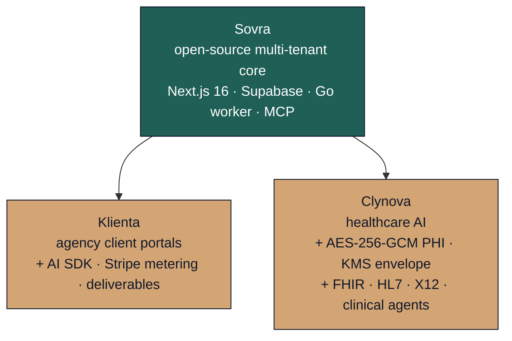

---

**Software you buy once, deploy yourself, and own completely.**
No subscriptions. No vendor access to your data.

[Website](https://byteworthy.io) &nbsp;·&nbsp; [Boilerplates](https://byteworthy.io/boilerplates) &nbsp;·&nbsp; [Services](https://byteworthy.io/services) &nbsp;·&nbsp; [Discord](https://byteworthy.io/discord) &nbsp;·&nbsp; [Newsletter](https://byteworthy.io/newsletter)

---

## What ByteWorthy ships

ByteWorthy is a small software studio building **multi-tenant AI infrastructure**, **healthcare-grade boilerplates**, and **operator-first open-source tools**. Three principles run through everything we publish:

1. **You own the source.** Buy or fork once. Self-host. No platform lock-in.
2. **Local-first by default.** No telemetry. ByteWorthy never touches your data.
3. **Plain-English output.** Every audit, scan, or report is something a human can read in seconds.

---

## The boilerplate family

Three boilerplates, one architectural lineage. Pick the one that matches your buyer.

| Boilerplate | What it is | License | Repo |
|---|---|---|---|
| **Sovra** | Open-source multi-tenant infrastructure for AI products. Auth, billing, MCP tool registry, pgvector search, real-time collaboration. The free starting point. | MIT | [ByteWorthyLLC/sovra](https://github.com/ByteWorthyLLC/sovra) |
| **Klienta** | White-label client portal for AI agencies. Per-tenant brand, deliverables, approvals, Stripe billing, AI SDK + MCP agent runtime. | Commercial | [ByteWorthyLLC/klienta](https://github.com/ByteWorthyLLC/klienta) |
| **Clynova** | HIPAA-ready healthcare AI boilerplate. AES-256-GCM PHI encryption with KMS envelope, append-only audit chain, BAA workflow, FHIR R4 + HL7 v2 + X12 EDI, six pre-built clinical agents. | Commercial | [ByteWorthyLLC/clynova](https://github.com/ByteWorthyLLC/clynova) |

**How they relate.** Sovra is the open foundation. Klienta and Clynova are commercial templates built on the same multi-tenant primitives — branched at the point where general-purpose stops and specialty starts.

---

## Open-source tools

Beyond the boilerplate family, ByteWorthy ships a small set of focused open-source tools — operator-first, local-first, no telemetry.

| Tool | What it does | Repo |
|---|---|---|
| **honeypot-med** | Prompt-injection evidence for healthcare AI workflows. OWASP LLM01 + NIST AI 600-1 anchored. Local CLI, browser widget, MCP server, GitHub Action. | [honeypot-med](https://github.com/ByteWorthyLLC/honeypot-med) |
| **byteworthy-defend** | Open-source CLI antivirus for Windows + Linux. JSON output, quarantine policy gates, YARA rules. Operator-first DevSecOps tooling. | [byteworthy-defend](https://github.com/ByteWorthyLLC/byteworthy-defend) |
| **vqol** | Patient-owned VEINES-QOL/Sym tracker. Static local-first PWA, no telemetry, one-file practice fork. | [vqol](https://github.com/ByteWorthyLLC/vqol) |
| **hightimized** | Audit a hospital bill, generate a dispute letter. Free, private, browser-only. | [hightimized](https://github.com/ByteWorthyLLC/hightimized) |
| **outbreaktinder** | Historic public-health events as a swipe deck. CC0 dataset, primary-source citations, embed-friendly. | [outbreaktinder](https://github.com/ByteWorthyLLC/outbreaktinder) |

---

## Ownership model

| | |
|---|---|
| **Pricing** | One-time commercial license for paid boilerplates. MIT for open-source projects. |
| **Source** | Buy once. Source provisioned to a private GitHub repository invited to your account. |
| **Hosting** | Self-host on your own Vercel + Supabase + Stripe + GCP / AWS / Azure accounts. |
| **Telemetry** | None. ByteWorthy never reaches into your deployment. |
| **Data** | Stays in your infrastructure. ByteWorthy never sees PHI, customer data, or usage metrics. |
| **Renewals** | None for the source. Optional support contracts available for commercial buyers. |

---

## Get access

| | |
|---|---|
| **Browse the boilerplates** | [byteworthy.io/boilerplates](https://byteworthy.io/boilerplates) — pricing, stack details, what's included |
| **Klienta** (agency portals) | [byteworthy.io/boilerplates/klienta](https://byteworthy.io/boilerplates/klienta) |
| **Clynova** (healthcare) | [byteworthy.io/boilerplates/clynova](https://byteworthy.io/boilerplates/clynova) |
| **Custom builds + AI consulting** | [byteworthy.io/services](https://byteworthy.io/services) |
| **Book a call** | [byteworthy.io/contact](https://byteworthy.io/contact) |

---

## Community + support

- **Discord** — [byteworthy.io/discord](https://byteworthy.io/discord) — design chat, releases, build-in-public
- **GitHub Discussions** — open in any repo for questions and design proposals
- **GitHub Issues** — bug reports and feature requests in the relevant repo
- **Security disclosures** — [security@byteworthy.io](mailto:security@byteworthy.io) — coordinated disclosure only, no public posts
- **Commercial inquiries** — [scale@getbyteworthy.com](mailto:scale@getbyteworthy.com) — managed setup, custom forks, team licensing

---

[Website](https://byteworthy.io) &nbsp;·&nbsp; [Boilerplates](https://byteworthy.io/boilerplates) &nbsp;·&nbsp; [Contributing](https://github.com/ByteWorthyLLC/.github/blob/main/CONTRIBUTING.md) &nbsp;·&nbsp; [Security](https://github.com/ByteWorthyLLC/.github/blob/main/SECURITY.md) &nbsp;·&nbsp; [Support](https://github.com/ByteWorthyLLC/.github/blob/main/SUPPORT.md)

Source-available · self-hosted · no platform lock-in · no telemetry

