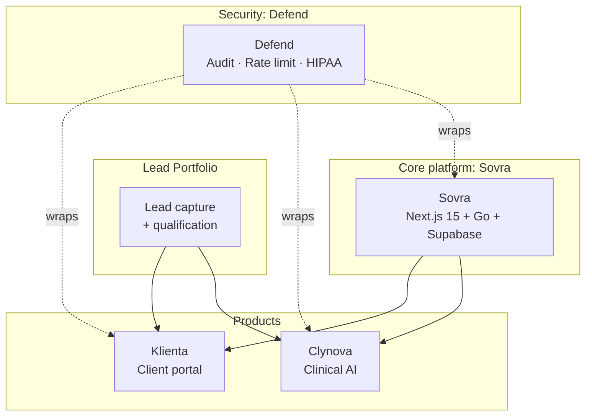

---

Software you buy once, deploy yourself, and own completely. No subscriptions. No vendor access to your data.

---

## The stack

| Product | What it is | For | Status | Repo |
|---------|-----------|-----|--------|------|
| **Sovra** | Open-source AI SaaS boilerplate. Next.js 15 + Go + Supabase. The foundation every ByteWorthy build starts from. | Teams who want to start with a real foundation instead of a blank repo | `MIT` · Active | [ByteWorthyLLC/sovra](https://github.com/ByteWorthyLLC/sovra) |
| **Klienta** | White-label client portal. Auth, billing, AI assistant, and client workflow tooling. Fork and ship under your brand. | Agencies needing a portal their clients log into | Commercial | [klienta-public](https://github.com/ByteWorthyLLC/klienta-public) |
| **Clynova** | Clinical AI template with HIPAA scaffolding, FHIR/HL7/X12 parsing, and local LLM support. PHI never leaves the server. | Healthcare practices that can not send patient data to a third party | Commercial + HIPAA | [clynova-public](https://github.com/ByteWorthyLLC/clynova-public) |
| **Defend** | Security and compliance layer. Rate limiting, audit logging, threat detection, HIPAA controls. Drops into any ByteWorthy stack. | Any team that needs compliance proof without building it from scratch | OSS · Active | [byteworthy-defend](https://github.com/ByteWorthyLLC/byteworthy-defend) |
| **Lead Portfolio** | Lead capture and qualification system. Connects directly into Klienta and Clynova operating flows. | Teams launching lead-gen-to-ops pipelines | Commercial | [byteworthy-lead-portfolio](https://github.com/ByteWorthyLLC/byteworthy-lead-portfolio) |

---

## How it composes

> Sovra is the base. Klienta and Clynova are production templates built on top of it. Defend wraps every layer. Lead feeds qualified prospects into whichever product your client runs.

---

## What ByteWorthy ships

| Product | Replaces | Who it's for |
|---------|----------|-------------|
| **Sovra** | Six weeks of boilerplate setup | Any team starting an AI SaaS |
| **Klienta** | Custom portal development ($25k+) | AI agencies, service businesses |
| **Clynova** | HIPAA consultant + dev contractor | Medical practices, behavioral health, ABA |
| **Defend** | Scattered compliance bolt-ons | Any self-hosted ByteWorthy stack |
| **Lead Portfolio** | CRM buildout + lead capture dev | Teams that need a working top-of-funnel now |

**Ownership model.** Buy once. Source included. Self-host in your own cloud.
Your data stays in your infrastructure. No monthly seat fees. No vendor access.

---

## Get access

**Browse the stack →** [byteworthy.io/boilerplates](https://byteworthy.io/boilerplates)
See every product with pricing, stack details, and what's included.

**Source licenses →** [Klienta license](https://github.com/ByteWorthyLLC/klienta-public) · [Clynova license](https://github.com/ByteWorthyLLC/clynova-public)
Commercial terms, what you can fork, what requires a seat.

**Pioneer pricing →** [byteworthy.io/pioneer](https://byteworthy.io/pioneer)
Early access pricing for teams who move first. Locked for life at the founding rate.

---

## Community + support

- **Discord**: [byteworthy.io/discord](https://byteworthy.io/discord): questions, builds in progress, feedback
- **GitHub Issues**: open an issue in the relevant repo for bugs and feature requests
- **Security disclosures**: [security@byteworthy.io](mailto:security@byteworthy.io): coordinated disclosure only, no public posts
- **Commercial inquiries**: [scale@getbyteworthy.com](mailto:scale@getbyteworthy.com): managed setup, custom forks, team licensing

---

[Website](https://byteworthy.io) &nbsp;·&nbsp; [Products](https://byteworthy.io/boilerplates) &nbsp;·&nbsp; [Contributing](https://github.com/ByteWorthyLLC/.github/blob/main/CONTRIBUTING.md) &nbsp;·&nbsp; [Security](https://github.com/ByteWorthyLLC/.github/blob/main/SECURITY.md) &nbsp;·&nbsp; [Support](https://github.com/ByteWorthyLLC/.github/blob/main/SUPPORT.md)

